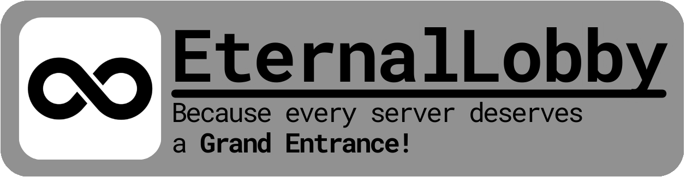

# Welcome to EternalLobby

EternalLobby is a plugin that supports all basic minecraft lobby features for your server. Enrich players experience giving them access to cosmetics, custom sounds and more fun stuff.

## ℹ️ Information

- EternalCore fully supports Minecraft's latest minor versions starting from each major version, starting from 1.17 onward, e.g. `1.17.1`, `1.18.2`, `1.19.4`, `1.20.1`.
- Requires **Java 17 or later** to work properly. For older versions of Java, this may affect the functionality of the plugin.
- If you have any questions feel free to ask us about it on [discord](https://discord.gg/FQ7jmGBd6c).

## ✨ Features:

Our plugin add standard features needed in lobby on your server:
- player visibility - turn on and off whether you can see other players,
- custom sounds for many player interactions,
- Lobby switcher - change lobby server if players annoy you,
- give items on join - items can be used to send players to corresponding servers,
- send custom messages to players using our template with colors
- add fun enrichment's like double jump

## Contributing:

To contribute to our project, fork project and make changes. Commit and push changes.
Then create a [pull request](https://github.com/EternalCodeTeam/EternalLobby/compare) from your branch to ours.
You can check pull requests in progress [here](https://github.com/EternalCodeTeam/EternalLobby/pulls).

## ✨ License

EternalLobby is published under the GNU GPL-v3 license.

- You are free to modify and improve the code.
- You can distribute production versions.
- You must publish any changes made (public fork of this repository).
- You cannot change the license or copyright.
- For more details, refer to the [LICENSE](LICENSE) file.

## Dependencies: 

EternalLobby is based on these dependencies:
- [LiteCommands (by Rollczi ❤️)](https://github.com/Rollczi/LiteCommands)
- [Okaeri Configs](https://github.com/OkaeriPoland/okaeri-configs) 
- [PlaceholderAPI](https://www.spigotmc.org/resources/placeholderapi.6245/)
- [LiteSkullAPI](https://github.com/Rollczi/LiteSkullAPI)
- [adventure by Kyori](https://github.com/KyoriPowered/adventure)

## Special thanks

We extend our gratitude to JetBrains for providing [Open Source Licenses](https://www.jetbrains.com/opensource/) for their outstanding tools. We recommend using [IntelliJ IDEA](https://www.jetbrains.com/idea/) to work with our projects and boost your productivity!

